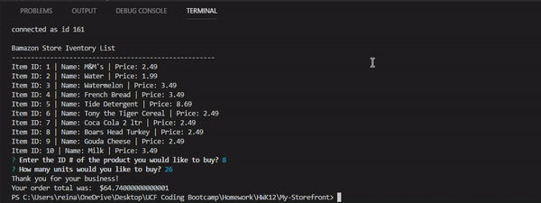

# My Bamazon Store Front

[My Bamazon Store Front](https://llanoreinaldo.github.io/My-Storefront/)

## OVERVIEW

In this activity, using the MySQL and Inquirer Node Packages, I created an Amazon-like storefront using MySQL skills. The app will take in orders from customers and deplete stock from the store's inventory. As a bonus task, I programmed this app to track product sales across the store's departments to provide a summary of the highest-grossing departments in the store.

## SCREENSHOTS

#### Typical User Flow: Customer Screenshots

1.  The app will prompt users with two messages.

    >The first should ask them the ID of the product they would like to buy.
    >The second message asks how many units of the product they would like to buy.

2.  Once the customer has placed the order, the application will check if your store has enough of the product to meet the customer's request. 

>If there is suffiecent quantities in stock, the log will reflect that their transaction went through and wil show their order total.

>If not, the app should log a phrase like `Insufficient quantity!`, and then prevent the order from going through.

#### Manager Portal: Screenshots

1.  The manager view will provide managers with four options they can select from: 

>View Products for Sale

> View Low Inventory (anything less than 5)
> Add Inventory

> Add New Product

## Video of App

Below is the full video of my command prompt for this project.

[Full Video](finalvideo.mp4)